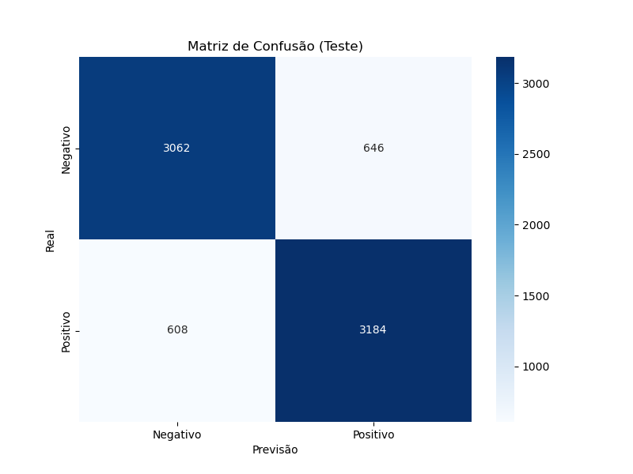

# Relatório de Métricas - Análise de Sentimentos

## Informações Gerais
- **Data de execução:** 24/05/2025 23:09:36
- **Modelo:** LSTM Bidirecional
- **Dataset:** IMDB Dataset (50K Movie Reviews)
- **Hardware:** CPU

## Métricas de Desempenho no Conjunto de Teste

| Métrica | Valor |
|---------|-------|
| Acurácia | 0.8328 |
| Precisão | 0.8313 |
| Recall | 0.8397 |
| F1-Score | 0.8355 |

## Matriz de Confusão

## Observações
- O modelo foi treinado por 0 épocas
- A melhor época foi escolhida com base na perda de validação (validation loss)
- A matriz de confusão mostra a distribuição de verdadeiros positivos, falsos positivos, verdadeiros negativos e falsos negativos

## Exemplos de Classificação

### Exemplo de resenha positiva
"This movie was amazing, I really enjoyed it and would recommend it to everyone!"  
**Sentimento previsto:** Positivo

### Exemplo de resenha negativa
"This movie was terrible, I couldn't even finish watching it. The acting was poor and the plot made no sense."  
**Sentimento previsto:** Negativo